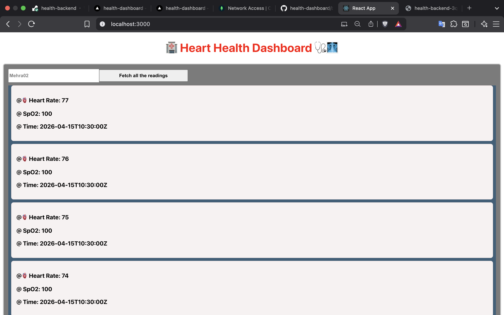
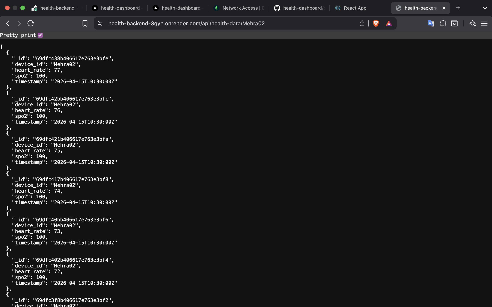

**MINI-HEALTH DASHBOARD SYSTEM**

## Overview

It is a full-stack application that collects health data from devices using API and displays it on a real time dashboard.

## Tech Stack : 

### Frontend: React.js
### Backend: Node.js + Express
### Database: MongoDB


## Setup Steps : 

### 1. Clone Repository : 

```bash
git clone https://github.com/Drin007/health-dashboard.git
cd health-dashboard
```

### 2. Backend Setup: 

```bash
cd backend
npm install
```

Start MongoDB:

```bash
mongod --dbpath ~/data/db
```

Run backend:

```bash
node server.js
```

### 3.Frontend setup : 

```bash
cd frontend
npm install
npm start
```

frontend runs on: http://localhost:3000

##  API Explanation : 

### 1. POST [/api/health-data](https://health-backend-3qyn.onrender.com/api/health-data)
stores health data in database.

#### Request body:

```json
{
  "device_id": "DEV123",
  "heart_rate": 78,
  "spo2": 97,
  "timestamp": "2026-04-15T10:30:00Z"
}
```

#### response output of the above example request:

```json
{
  "message": "Data saved successfully"
}
```

---

###  2. GET [/api/health-data/:device_id](https://health-backend-3qyn.onrender.com/api/health-data/:device_id)

Fetches latest 10 records for a single device.

#### Example:

```
GET /api/health-data/Mehra02
```

#### output of above example:

```json
[
  {
    "device_id": "Mehra02",
    "heart_rate": 80,
    "spo2": 90,
    "timestamp": "2026-04-15T10:30:00Z"
  }
]
```

## Features Provided : 

- Stores real time health data.
- Fetch latest 10 records that is entered.
- Auto refresh dashboard after every 5 seconds. 
- clean and simple UI
- shows loading state

## workflow : 

Device sends data via POST API -> backend stores data in MongoDB -> frontend fetches data using GET API -> dashboard updates automatically

## Live deployement

Frontend (Vercel): https://health-dashboard-three-coral.vercel.app/ 
Backend (Render): https://health-backend-3qyn.onrender.com/api/health-data/Mehra02

## Environment variables

Backend uses environment variables for secure database connection:

MONGO_URI=mongodb+srv://<username>:<andsecretpasswordoftheuser>@cluster0.ygyjbzw.mongodb.net/healthDB

# API Testing

APIs were tested using tools like: Postman and Browser 

# Challenges Faced

- Mongodb atlas connection issues because of ip restriction
- Environment variable setup in deployment
- React useEffect dependency handling as it was causing deployment issues
- CORS handling between frontend and backend

# screenshots of project ( front end and backend )






